# Tesla (TSLA) Forecast Lab

Walk-forward-validated, ensemble-based forecasting of Tesla's stock price for the **next 1–2 trading weeks**, with
**calibrated prediction intervals**, a Monte-Carlo risk view, news-sentiment context, a Streamlit dashboard and a fully
executed analysis notebook.

> **Educational research, not financial advice.** Read [Results](#results-honestly) before relying on any number.

**Contents:** [Overview](#overview) · [Results](#results-honestly) · [Quick start](#quick-start) · [Method](#method) ·
[Gallery](#more-figures) · [Repository layout](#repository-layout) · [Limitations](#limitations) · [Security](#security-note)

---

## Overview

| Layer | Details |
|---|---|
| **Data** | yfinance → disk cache → bundled CSV fallback; validation; NYSE trading calendar (no weekend/holiday forecast dates); incomplete intraday bars dropped; SPY / QQQ / VIX market context |
| **Features** | 56 strictly causal, stationary features: momentum, volatility regimes (EWMA, Parkinson, Garman-Klass, ATR), trend / mean-reversion (SMA ratios, RSI, MACD, Bollinger, 52-week range), volume, day-of-week, market beta & relative strength |
| **Models** | Random walk · drift · ARIMA · Theta · Ridge · LightGBM · XGBoost · **GRU-attention · TCN · Transformer** (PyTorch). Direct multi-horizon, volatility-normalised targets |
| **Ensemble** | Online inverse-error weighting that uses *only outcomes already realised* at each forecast origin |
| **Uncertainty** | Volatility-normalised rolling **conformal intervals** (80 % / 95 %), empirical `P(up)`, filtered-historical-simulation risk (VaR, CVaR, drawdown) |
| **Evaluation** | Expanding-window walk-forward backtest (756 origins), RMSE / MAE / MAPE / MASE, hit-rate, out-of-sample R² on returns, skill vs random walk, Diebold-Mariano tests, interval coverage |
| **App** | Streamlit dashboard: forecast fan chart, technicals, leaderboard, calibration, risk simulation, headlines + insights (rule-based, optional LLM) |
| **Engineering** | Typed YAML config (pydantic), CLI, 44 tests (incl. no-leakage proofs), ruff, GitHub Actions CI, Dockerfile |

## Results (honestly)

Out-of-sample: 756 daily forecast origins (Sep-2023 → Oct-2026), every model re-fit quarterly, data through 2026-10-06.
Regenerated by the notebook into `reports/backtest_metrics.csv`.

| Horizon | Ensemble MAPE | Ensemble RMSE | RMSE vs random walk | Direction hit-rate |
|---|---|---|---|---|
| t+1 | 2.6 % | $11.1 | +0.1 % | 52.4 % |
| t+5 | 5.9 % | $23.8 | −0.2 % | 49.2 % |
| t+10 | 8.6 % | $33.6 | −0.6 % | 49.4 % |

Interval coverage (averaged over horizons 1–10): **nominal 80 % → 82.7 %, nominal 95 % → 96.0 %**.

**Latest forecast** (from the $380.68 close of 2026-10-06): about **$382 by 2026-10-20**, 80 % range **$349 – $413**, P(up) ≈ 53 %.

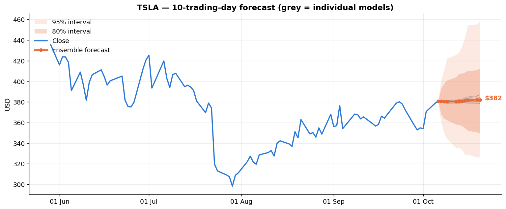

What to take from this:

* **No model beat the random walk by a statistically significant margin** — 0 of 100 model × horizon pairs at the 5 % level
  (about 5 would pass by chance). That matches decades of evidence for liquid stocks; the notebook measures it rather than assuming it.
* **Price-level R² ≈ 0.99 is meaningless.** "Tomorrow = today" scores the same. The original notebook's R² was of that kind
  (and it trained on its own test set — see `notebooks/legacy/README.md`).
* **What is reliable:** dollar errors are small because the last close is an excellent anchor, and the **intervals are calibrated** and
  widen with volatility. Use the output for ranges, scenarios and risk sizing — not for confident point calls.
* Some hyper-parameters (e.g. the strong regularisation of the tree models) were chosen with the backtest window in view, so treat the
  reported skill as slightly optimistic.

| Skill vs the random walk, per model | Interval calibration |
|---|---|
| 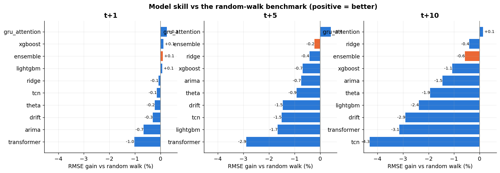 | 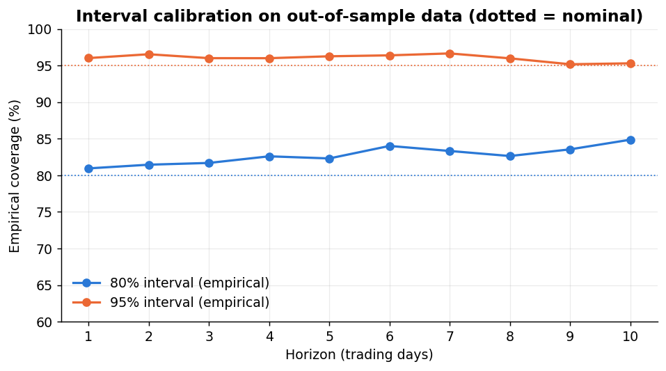 |

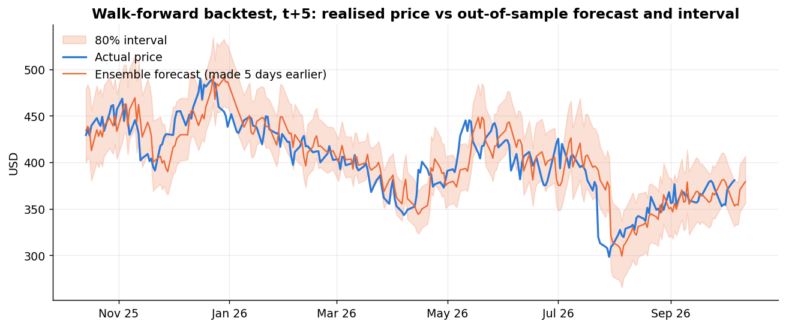

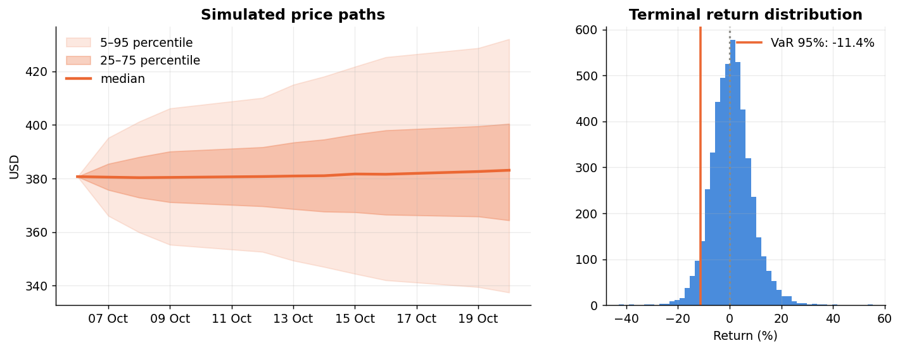

## Quick start

All commands from the repository root with the `myenv` conda environment:

```bash
conda activate myenv
pip install -r requirements.txt        # installs only what is missing
pip install -e .                       # exposes `tesla-forecast` and `import tesla_forecast`

make train        # backtest all models + fit final models -> artifacts/pipeline.joblib   (~2 min)
make forecast     # print the forecast table
make figures      # write the static report PNGs to reports/figures/
make app          # Streamlit dashboard at http://localhost:8501
make test         # 44 tests, ~10 s, fully offline
jupyter lab notebooks/01_tesla_advanced_forecasting.ipynb     # kernel: "Python 3 (myenv)"
```

Useful CLI options: `tesla-forecast train --quick` · `--horizon 15` · `--models naive,ridge,lightgbm` · `--offline` · `--refresh`.
Optional LLM insights: copy `.env.example` → `.env` and set `LLM_PROVIDER` (`huggingface` or `openai`) plus its key.
Forecasting and the app work with **no keys at all**.

## Method

1. **Target.** `y_h = log(P[t+h] / P[t])` for h = 1…H. Returns are stationary; prices are not (ADF / KPSS in the notebook).
2. **Direct multi-horizon.** One output per horizon (GBMs at anchor horizons, interpolated). Targets are divided by `EWMA-vol × √h`
   so learners see signal rather than volatility.
3. **Walk-forward.** Every ~63 days all models are re-fit on data available *then* and forecast each origin from rows ≤ origin.
   Unit tests corrupt future rows and assert the predictions of **every** model are unchanged.
4. **Online ensemble.** Weight ∝ (trailing realised MSE)⁻¹ (power 2, 15 % shrinkage to equal), computed only from outcomes with `pos_j + h ≤ pos_i`.
5. **Conformal intervals.** Standardised residuals `(y − ŷ) / (vol·√h)`; finite-sample-corrected empirical quantiles over the last 400
   realised origins; lower/upper estimated separately (captures skew); widths forced non-decreasing in h.
6. **Risk simulation.** Bootstrapped vol-standardised shocks with EWMA volatility feedback; drift = ensemble forecast. Agrees with the conformal range
   (simulated 10–90 % ≈ $349–$419 vs conformal 80 % $349–$413).

## More figures

All 31 figures produced by the notebook live in [`reports/figures/`](reports/figures/) (numbered by notebook section; the un-numbered ones are static twins of the
interactive Plotly charts).

| Market & data | Model evaluation |
|---|---|
| 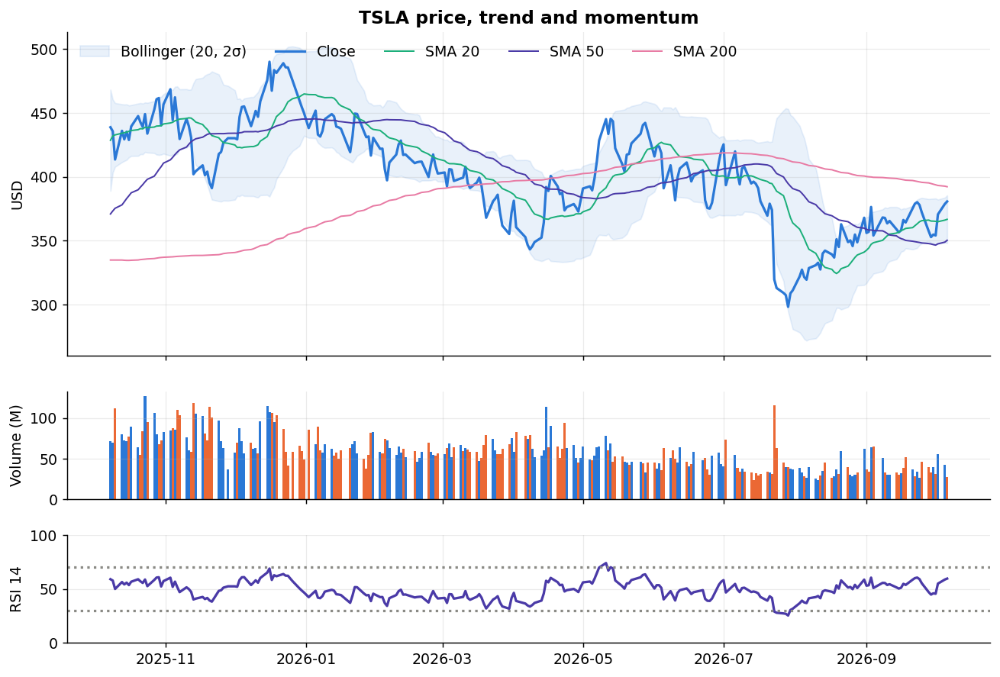 | 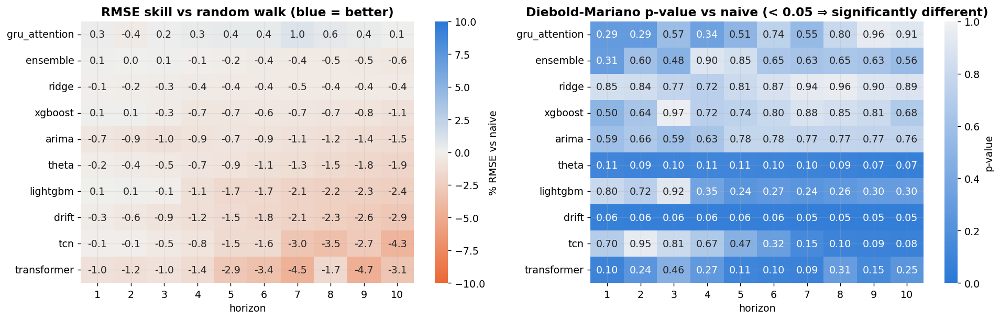 |
| 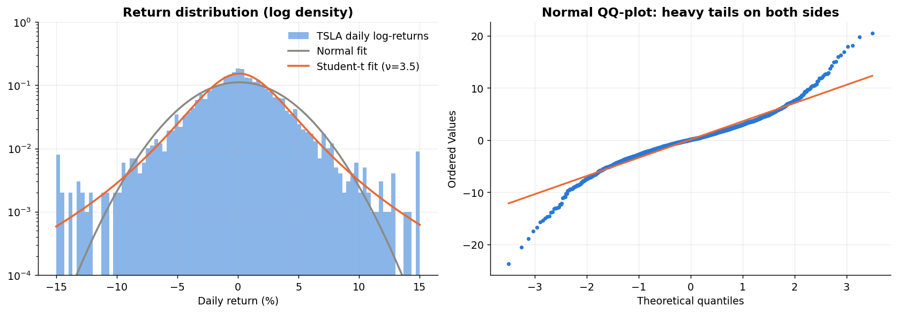 | 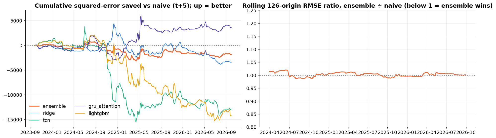 |
| 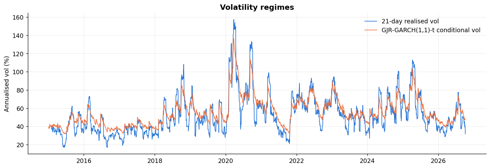 | 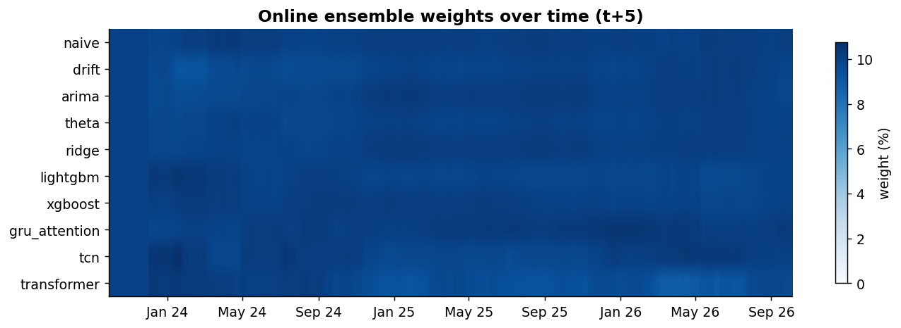 |
| 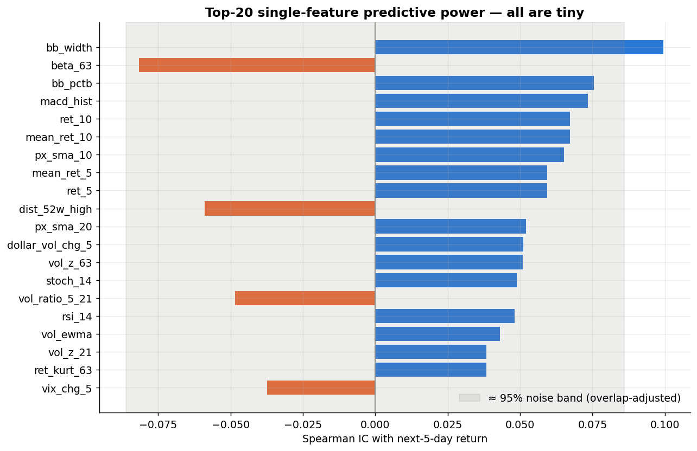 | 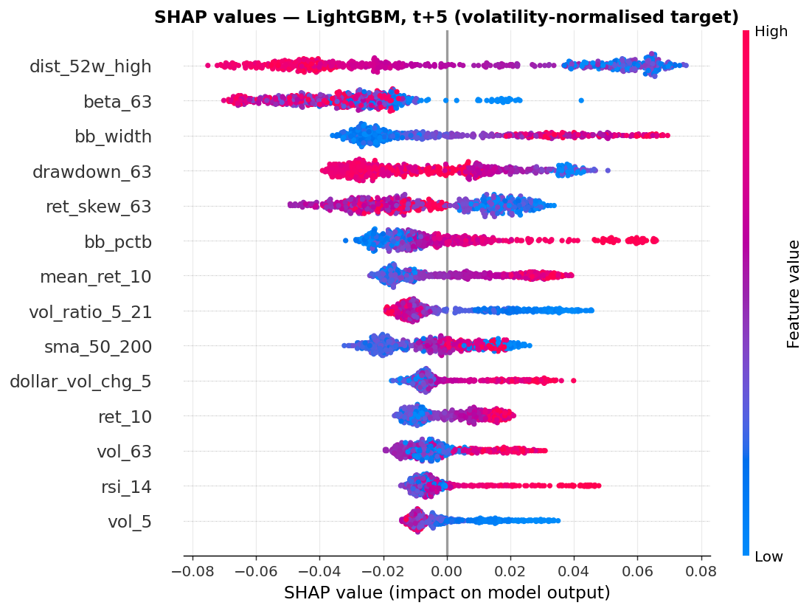 |

## Repository layout

```
├── src/tesla_forecast/
│   ├── config.py            typed config (configs/default.yaml)
│   ├── cli.py               tesla-forecast {data,backtest,train,forecast,figures}
│   ├── data/                loader (yfinance / cache / CSV), NYSE calendar
│   ├── features/            indicators.py, engineering.py (causal features + targets)
│   ├── models/              baselines, statistical, supervised (Ridge/GBM), deep (GRU/TCN/Transformer), volatility, registry
│   ├── evaluation/          metrics, walk-forward backtest, online ensemble, conformal intervals
│   ├── forecasting/         pipeline orchestration, Monte-Carlo simulation
│   ├── sentiment/           news (RSS), finance lexicon, rule-based + LLM insights
│   └── viz/                 Plotly builders (app), matplotlib report figures, shared palette
├── app/streamlit_app.py     dashboard
├── notebooks/               01_tesla_advanced_forecasting.ipynb (executed) · legacy/ (v1 material)
├── configs/default.yaml     all tunables
├── tests/                   pytest suite (synthetic data, no network)
├── data/raw/                bundled 2015–2025 CSV (offline fallback)
├── reports/                 backtest_metrics.csv, interval_coverage.csv, latest_forecast.csv, figures/
├── artifacts/               trained pipeline (git-ignored)
├── docs/                    v1 report (PDF)
└── Dockerfile · docker-compose.yml · Makefile · pyproject.toml · .github/workflows/ci.yml
```

## Limitations

* Point forecasts carry no demonstrated edge over a random walk; do not trade on them.
* Gap moves on news/earnings can exceed any interval (TSLA daily returns have excess kurtosis ≈ 4).
* Headline sentiment is a transparent keyword score shown for context; it is *not* a model input.
* yfinance is an unofficial API and can rate-limit; the loader degrades to cache, then to the bundled CSV (ends Feb-2025, flagged as stale in the UI).
* The Dockerfile has not been built in CI/testing yet. Pickled artifacts (`artifacts/pipeline.joblib`) must only be loaded from sources you trust.

## Security note

The original repository committed a Hugging Face API token (`api_token.py`). It was removed from the working tree and replaced by
environment-variable configuration, **but it still exists in git history — revoke/rotate that token** in your Hugging Face settings.
